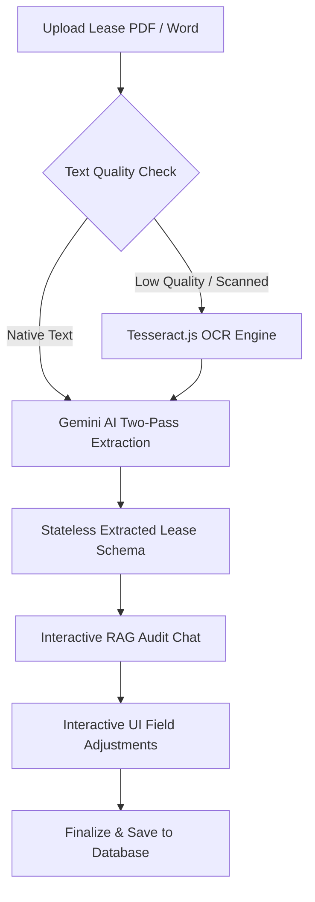
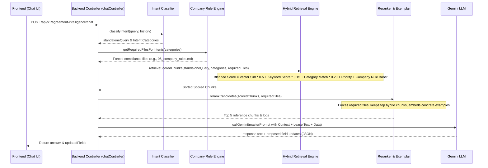

# Agreement Intelligence Flow under IND AS 116

This document provides a comprehensive blueprint of the **Agreement Intelligence** workflow, detailing the user journey, frontend-backend interactions, API specifications, and the underlying logic (OCR heuristics, RAG semantic engine, and Gemini AI two-pass extraction).

---

## 1. System Architecture Overview

The system implements an **assessment-first, extraction-later** design built specifically for **IND AS 116 (Lease Accounting)** compliance. It helps financial analysts verify if an agreement contains a lease, extract all compliant parameters, resolve inconsistencies, audit AI results via interactive chat, and save finalized data.



---

## 2. Phase 1: PDF/Word Upload & Data Extraction Pipeline

The document extraction process is stateless. It validates the file, extracts plain text (optionally running OCR), and uses Gemini to analyze and normalize fields.

### Pipeline Execution Flow

1. **File Upload & Validation**:
   - **Endpoint**: `POST /api/v1/lease/extract-pdf`
   - **Supported MIME Types**: PDF (`application/pdf`), Word (`.doc`, `.docx`).
   - **Size Limit**: 15MB.
2. **Digital Text Extraction**:
   - Native PDFs use `pdf-parse` to extract text instantly.
   - Word files use `mammoth` to parse raw HTML-style content.
3. **Quality & Scanned Document Heuristics**:
   - If `total_characters < 1500` OR `average_characters_per_page < 500`:
     - **Action**: Triggers OCR Fallback.
     - **Process**: Uses `pdf-parse` to generate high-resolution (scale 2.0) page screenshots, then runs `tesseract.js` OCR (English worker) per page.
4. **Gemini Pass 1: Legal & Commercial Analysis**:
   - Sends the raw extracted text to Gemini with a structured prompt.
   - Instructs Gemini to read like a senior legal/financial auditor and map findings under key headings (Parties, Nature, Dates, Escalations, Rent-free, Deposits, etc.).
5. **Gemini Pass 2: Schema Conversion & Strict JSON Mapping**:
   - Pass 1 output is fed into Pass 2.
   - Gemini formats the parsed analysis into a strict JSON payload conforming exactly to the lease model.
   - Normalizes Indian currency formatting (e.g. `Rs. 4,55,000` to standard numeric `455000`) and forces date formats (`YYYY-MM-DD`).
6. **Post-Processing & Defaults**:
   - Strips code fences and parses JSON.
   - **Working & Locking Period Defaults**: If `leaseWorkingPeriod` or `lockingPeriod` are not explicitly in the text, they default to `leasePeriod`.
   - **Rent-Free Period defaults**: Defaults to 100% waiver if not otherwise specified.
   - **Manual Review Check**: If `confidence < 0.70`, sets `requiresManualReview: true`.

---

## 3. Phase 2: RAG Interactive Auditing (Chat Engine)

Once the data is extracted, the user sees a side-by-side view (Dashboard + Chat). The chat is powered by a custom **Retrieval-Augmented Generation (RAG)** pipeline that applies semantic matching on corporate policies, regulatory standards (IND AS 116), and previous contexts.

### The RAG Search & Query Pipeline

When a user asks a question (e.g., *"Why did you default the lock-in period to lease period?"*), the backend coordinates a multi-step retrieval:



### Intent Classification
The backend categorizes queries into 11 distinct buckets to retrieve relevant guidelines:

| Intent Category | Description / Scope | Target Reference Files |
|---|---|---|
| `LEASE_IDENTIFICATION` | Asset control, substitution rights, identifying a lease. | `02_lease_identification.md`, `09_common_mistakes.md` |
| `LEASE_TERM` | Lease tenure, renewals, short term leases, rent-free. | `03_lease_term.md` |
| `COMMENCEMENT_DATE` | Possession date, effective date rules. | `03_lease_term.md`, `07_extraction_rules.md` |
| `DISCOUNT_RATE` | Discount rate, Incremental Borrowing Rate (IBR) logic. | `04_discount_rate.md` |
| `LEASE_LIABILITY` | PV calculations, amortisation schedules, formulas. | `05_lease_liability.md`, `09_common_mistakes.md` |
| `LEASE_MODIFICATION` | Changes, modifications, transfers, terminations. | `04_discount_rate.md`, `05_lease_liability.md` |
| `EXTRACTION_RULES` | Heuristics on how specific fields are parsed. | `07_extraction_rules.md` |
| `VALIDATION` | Data locking, period defaults, consistency checkers. | `08_confidence_rules.md`, `12_output_schema.md` |
| `API_BEHAVIOUR` | API endpoints, Server-Sent Events, chat formatting. | `11_api_behaviour.md` |
| `COMMON_MISTAKES` | Catalog of accounting pitfalls (e.g. Possession vs. Rent Start). | `09_common_mistakes.md` |
| `REAL_EXAMPLES` | Parsed lease examples and calculated liabilities. | `10_real_examples.md` |

### Hybrid Search Blended Score Formula
For every document chunk, a hybrid score is computed to select the most relevant guidelines:

$$Score = (VectorSimilarity \times 0.5) + (KeywordOverlap \times 0.15) + (CategoryMatch \times 0.2) + PriorityBoost + CompanyRuleBoost$$

- **Priority Boost**: Scale of `0.02` to `0.10` depending on document priority.
- **Company Rule Boost**: A boost of `0.15` is applied to `06_company_rules.md` if the user's intent is classified in categories matching company overrides, ensuring corporate rules always prioritize general accounting standards.

### Reranker Strategy
1. **Force Required Compliance**: Evaluates candidates and guarantees matching forced files (like `06_company_rules.md`) are placed first in context.
2. **Blended Hybrid Selection**: Fills empty slots (up to 5 total) with high hybrid-scored chunks.
3. **Exemplar Inclusion**: Ensures at least one concrete example chunk is present in the prompt context to ground calculations.

---

## 4. Phase 3: Field Updates and Finalization

If the user requests an adjustment in the chat (e.g., *"Change the rent to 60,000"*), or edits a field on the Dashboard manually, the application synchronizes changes.

### Acknowledging Updates (Flow)
- **Interactive Chat Updates**: Gemini includes the update in its JSON response in the `updatedFields` array:
  ```json
  {
    "text": "Sure, I have updated the monthly rent amount to 60000 in accordance with your request.",
    "updatedFields": [
      { "fieldName": "Rent Amount", "newValue": "60000", "status": "CONFIRMED_BY_USER" }
    ]
  }
  ```
  The frontend reads `updatedFields` and updates the Dashboard state dynamically.
- **Manual Dashboard Edits / Confirmations**:
  When a user confirms a field (clicks the Check icon) or types a correction directly into the input, the frontend triggers `PUT /api/v1/agreement-intelligence/fields`.
  - In this stateless execution version, the backend logs the update (`console.log`) and returns success.
  - Clicking **Finalize Agreement Data** validates the inputs, completes the audit, and pushes the finalized dataset to the primary database schema.

---

## 5. API Reference & Schemas

### 1. Upload PDF
- **Endpoint**: `POST /api/v1/lease/extract-pdf`
- **Content-Type**: `multipart/form-data`
- **Request Body**:
  ```
  pdfFile: [binary file]
  trackingId: "optional-uuid-for-sse-progress"
  ```
- **Response** (`200 OK`):
  ```json
  {
    "lessorName": "Apex Properties Ltd",
    "natureOfLease": "Building",
    "leasePeriod": { "start": "2026-04-01", "end": "2029-03-31" },
    "leaseWorkingPeriod": { "start": "2026-04-01", "end": "2029-03-31" },
    "lockingPeriod": { "start": "2026-04-01", "end": "2029-03-31" },
    "rentPaymentType": "Arrear Payment",
    "rentPaymentFrequency": "monthly",
    "rentAmount": 150000,
    "rentPaymentDate": 5,
    "securityDeposit": 450000,
    "discountingRates": [
      { "dateRange": ["2026-04-01", "2029-03-31"], "rate": 8.5 }
    ],
    "systematicEscalations": [],
    "adhocEscalations": [],
    "rentFreePeriods": [],
    "confidence": 0.95,
    "requiresManualReview": false,
    "agreementId": "AGR-178239234823",
    "rawText": "..."
  }
  ```

### 2. SSE Progress Stream
- **Endpoint**: `GET /api/v1/lease/extract-progress?trackingId=<uuid>`
- **Response**: `text/event-stream` returning:
  ```json
  { "stage": "ai-analysis", "percentage": 70, "message": "Understanding lease agreement..." }
  ```

### 3. Interactive Chat
- **Endpoint**: `POST /api/v1/agreement-intelligence/chat`
- **Request Body**:
  ```json
  {
    "agreementId": "AGR-178239234823",
    "message": "Why is the rent-free period empty?",
    "extractedData": { ... },
    "rawText": "...",
    "history": []
  }
  ```
- **Response** (`200 OK`):
  ```json
  {
    "text": "Based on the lease agreement text (Section 4), there are no mentions of rent-free or fit-out periods. Hence, the rentFreePeriods array is empty, which matches the document's terms.",
    "updatedFields": [],
    "_ragDebug": {
      "intent": {
        "categories": ["LEASE_TERM"],
        "standaloneQuery": "Is there any rent-free or fit-out period in the lease?",
        "explanation": "Query is asking about rent-free periods, which falls under lease term."
      },
      "reasoning": [
        "[Forced Rule/Intent Match] Chunk: chunk-lease-term-1 | Sim: 0.85"
      ],
      "context": "..."
    }
  }
  ```

### 4. Acknowledge Field Update
- **Endpoint**: `PUT /api/v1/agreement-intelligence/fields`
- **Request Body**:
  ```json
  {
    "agreementId": "AGR-178239234823",
    "fieldUpdates": [
      { "fieldName": "Rent Amount", "newValue": "160000", "status": "CONFIRMED_BY_USER" }
    ]
  }
  ```
- **Response** (`200 OK`):
  ```json
  { "success": true, "message": "Fields updated successfully" }
  ```

---

## 6. Frontend State & UI Mapping

On the client side, `AgreementIntelligence.tsx` holds the master state:
- `agreementData`: Holds `{ agreementId, fileName, extractedFields: ExtractedField[], rawText }`.
- **Field Status States**:
  - `FOUND`: Field parsed successfully with confidence $\ge 0.80$.
  - `MISSING`: Field not found.
  - `UNCERTAIN`: Field found with confidence $< 0.80$. Requires confirmation.
  - `CONFIRMED_BY_USER`: Field approved or updated by user.
  - `REJECTED_BY_USER`: Field explicitly rejected.

The chat window renders messages from `history` and allows users to discuss the extracted fields, highlighting sources cited in the response text (e.g., `[06_company_rules.md]`).
